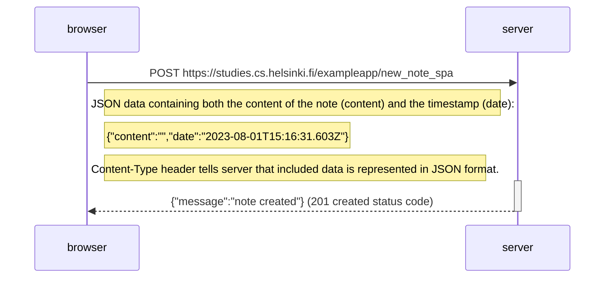

```mermaid
sequenceDiagram
    participant browser
    participant server

    browser->>server: POST https://studies.cs.helsinki.fi/exampleapp/new_note_spa
    Note right of browser: JSON data containing both the content of the note (content) and the timestamp (date):
    Note right of browser: {"content":"","date":"2023-08-01T15:16:31.603Z"}
    Note right of browser: Content-Type header tells server that included data is represented in JSON format.
    activate server
    server-->>browser: {"message":"note created"} (201 created status code)
    deactivate server
```